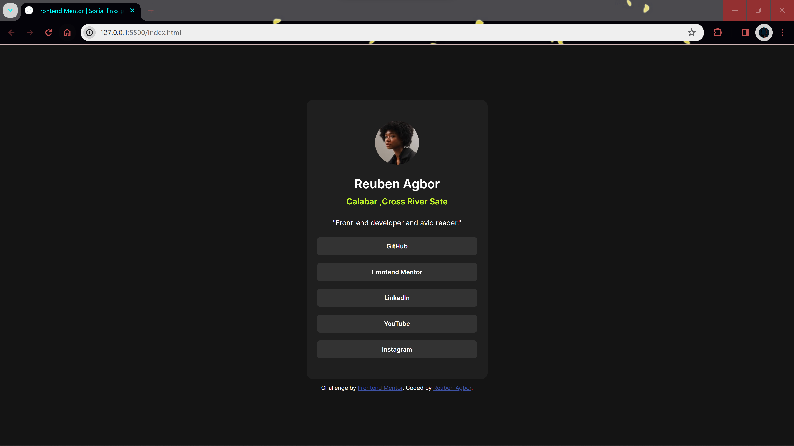
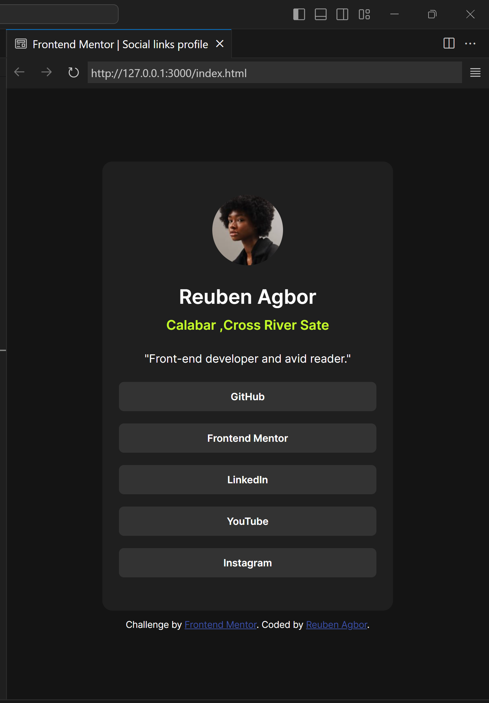

# Frontend Mentor - Social links profile solution

This is a solution to the [Social links profile challenge on Frontend Mentor](https://www.frontendmentor.io/challenges/social-links-profile-UG32l9m6dQ). Frontend Mentor challenges help you improve your coding skills by building realistic projects. 

## Overview

### The challenge

Users should be able to:

- See hover and focus states for all interactive elements on the page

### Screenshot

### Links

- Solution URL: [https://github.com/Reuben-10/Social-link-profile]
- Live Site URL: [https://reuben-10.github.io/Social-link-profile/]

## My process

### Built with

- Semantic HTML5 markup
- CSS custom properties
- Flexbox

## Author

- Website - [Reuben Agbor]
- Frontend Mentor - [@Reuben-10](https://www.frontendmentor.io/profile/Reuben-10)
- Twitter - [@reuben_agbor](https://twitter.com/reuben_agbor)

